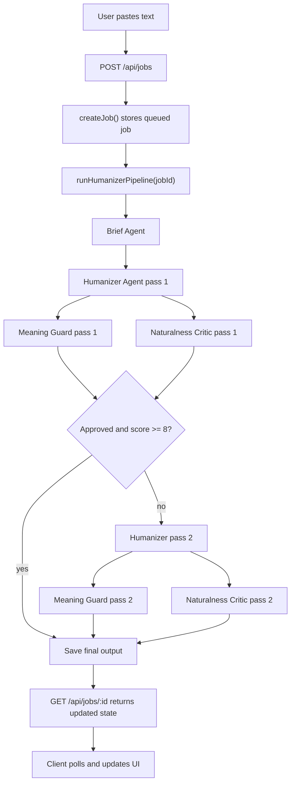

# Architecture

This document explains the overall structure of Humanizer Lab.

## Main Idea

Humanizer Lab demonstrates a simple multi-agent pattern:

- one model provider: MiniMax
- four visible agents
- one orchestrator
- one in-memory job store
- one polling-based UI

The app does not use a special agent framework. Each "agent" is really just:

1. a prompt
2. a JSON output contract
3. a small TypeScript wrapper

## Mental Model

Think of the app like this:

- `MiniMax` is the brain engine
- `prompts` define each role's behavior
- `agent wrappers` call the model and normalize the JSON
- the `orchestrator` decides what runs next
- the `store` remembers the state of each job
- the `UI` shows what the backend is doing

## End-To-End Flow

## Runtime Responsibilities

### Browser

The browser is responsible for:

- collecting input text
- starting a job
- polling job state every ~900 ms
- showing agent status, timeline events, and outputs

The browser is not responsible for:

- calling MiniMax directly
- storing API keys
- deciding pipeline logic

### Next.js Server

The server is responsible for:

- validating input
- creating the job
- running the orchestrator
- calling MiniMax
- storing intermediate and final results
- returning job snapshots to the client

## Main Files And Their Roles

### `app/api/jobs/route.ts`

Creates a job from `inputText`, stores it, and starts orchestration asynchronously.

### `app/api/jobs/[id]/route.ts`

Returns the full current job state for polling.

### `lib/orchestrator.ts`

This is the most important server file.

It:

- runs each step in order
- updates job status
- logs events
- decides whether a revision pass is needed
- saves final output or failure state

### `lib/store.ts`

This is the app's temporary memory layer.

It uses a `Map<string, JobState>` to keep jobs in memory while the server is running.

### `lib/types.ts`

This is the shared contract for the app.

It defines:

- job status
- agent names
- output schemas
- event shape
- final result shape

### `lib/prompts.ts`

Contains the prompt builders for each agent and the JSON shape each prompt is expected to return.

### `lib/agents/*`

Each file is a thin wrapper around one agent call.

Each wrapper:

- builds the prompt
- calls `runMiniMax()`
- normalizes the JSON response

### `components/*`

These files render the UI and keep the client-side state readable.

## Why The App Uses Polling

The app uses polling instead of websockets or SSE because this is a teaching project.

Polling keeps the app easier to understand:

- the backend only needs two simple routes
- the client just re-fetches job state on an interval
- there is no streaming or connection management

That simplicity is useful when learning the architecture.

## Why The App Uses An In-Memory Store

The store is intentionally simple:

- no database setup
- no queue workers
- no persistence layer

This means:

- restarting the server clears jobs
- the app is not production-ready
- the control flow stays easy to trace

## Safe Reading Order In Code

If you want to understand the code from top to bottom, open files in this order:

1. `app/page.tsx`
2. `components/HumanizerLab.tsx`
3. `app/api/jobs/route.ts`
4. `app/api/jobs/[id]/route.ts`
5. `lib/orchestrator.ts`
6. `lib/store.ts`
7. `lib/types.ts`
8. `lib/prompts.ts`
9. `lib/agents/*`
